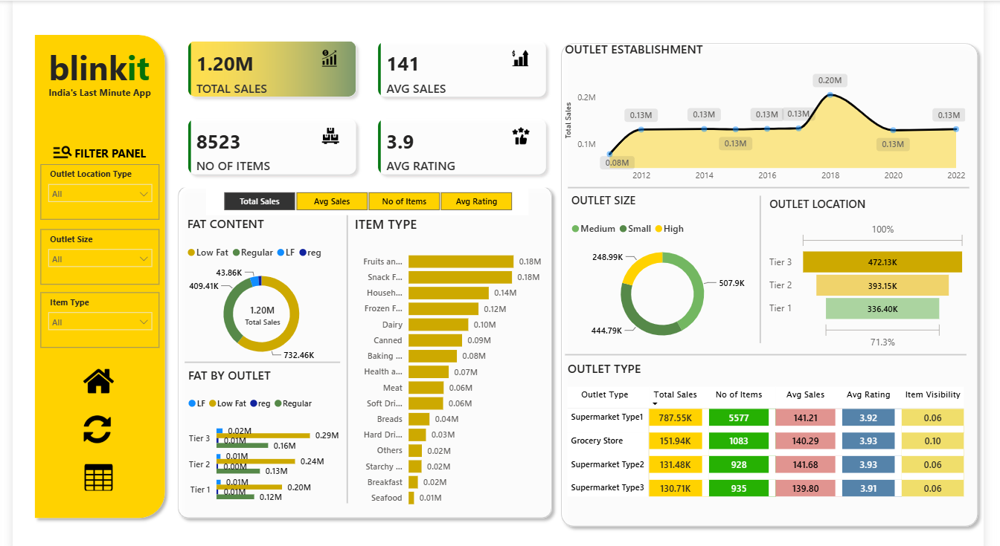

# 🛒 BlinkIT Sales Analytics Dashboard

An interactive **Business Intelligence Dashboard** built using **Power BI** to analyze BlinkIT grocery sales data. This project transforms raw transactional data into meaningful business insights through data cleaning, data modeling, DAX measures, and interactive visualizations, enabling data-driven decision-making.

---

## 📌 Project Overview

The objective of this project is to analyze BlinkIT's sales performance across different outlet types, locations, item categories, and customer ratings. The dashboard provides a comprehensive view of key business metrics, helping stakeholders identify trends, evaluate outlet performance, and uncover growth opportunities.

---

## 🎯 Business Objectives

- Monitor overall sales performance
- Analyze outlet-wise and location-wise sales
- Evaluate product category performance
- Track customer ratings and purchasing trends
- Identify high-performing and low-performing business segments
- Support data-driven business decisions through interactive dashboards

---

## 🛠️ Tech Stack

- **Power BI**
- **Power Query**
- **DAX (Data Analysis Expressions)**
- **Microsoft Excel**
- **Data Modeling**
- **ETL (Extract, Transform, Load)**

---

## 📂 Dataset

The dataset contains BlinkIT grocery sales information, including:

- Outlet Details
- Item Information
- Sales
- Ratings
- Fat Content
- Outlet Size
- Outlet Location
- Establishment Year
- Item Type

---

## 📊 Dashboard KPIs

- 💰 Total Sales
- 📦 Number of Items Sold
- ⭐ Average Customer Rating
- 💵 Average Sales per Item

---

## 📈 Dashboard Features

### Executive Dashboard
- Overall Sales Performance
- KPI Cards
- Interactive Filters

### Sales Analysis
- Sales by Outlet Type
- Sales by Outlet Size
- Sales by Location Tier
- Sales Trend Analysis

### Product Analysis
- Sales by Item Type
- Fat Content Analysis
- Top Performing Categories

### Outlet Performance
- Outlet Establishment Trends
- Outlet Type Comparison
- Location-wise Performance

---

## 🔍 Key Business Insights

- Tier 3 outlets generated the highest overall sales.
- Supermarket Type 1 contributed the largest share of total revenue.
- Regular Fat products outperformed Low Fat products in sales.
- Certain product categories consistently generated higher revenue.
- Customer ratings remained stable across most outlet types.

---

## 💡 Business Recommendations

- Increase inventory in high-performing Tier 3 locations.
- Promote low-performing product categories through targeted campaigns.
- Expand successful outlet formats into underserved regions.
- Improve customer engagement for outlets with lower average ratings.
- Optimize product assortment based on category performance.

---

## 📷 Dashboard Preview

### Executive Dashboard


> 

---

## 📁 Project Structure

```
BlinkIT-Sales-Analytics-Dashboard/
│
├── BlinkIT Dashboard.pbix
├── README.md
├── LICENSE
│
├── Dataset/
│   └── BlinkIT Grocery Data.xlsx
│
├── Images/
│   └── Dashboard.png
│
└── SQL/
    └── SQL_Queries.sql
```

---

## 🚀 Skills Demonstrated

- Business Intelligence
- Data Cleaning
- Data Transformation
- Data Modeling
- DAX Calculations
- Dashboard Design
- KPI Development
- Interactive Reporting
- Business Analysis

---

## 📌 Future Enhancements

- Add Time Intelligence (MoM & YoY Analysis)
- Sales Forecasting
- Customer Segmentation
- Profit Margin Analysis
- Row-Level Security (RLS)
- Drill-through Reports

---

## 📬 Contact

**Yash Agarwal**

- LinkedIn: *https://www.linkedin.com/in/yashagarwal-*
- GitHub: *https://github.com/Yash-Agarwal-4a5h*

---

## ⭐ If you found this project useful, consider giving it a star!
